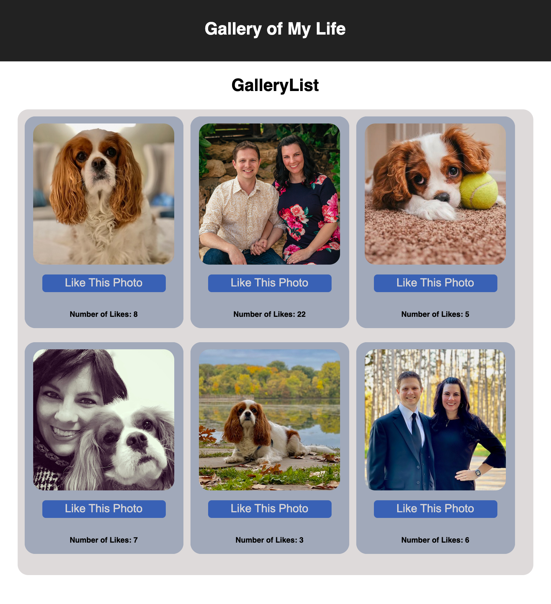

   
# Teir2-Week8-WeekendChallenge-ReactGallery

## Table of Contents

- [Description](#description)
- [Screenshots](#screenshots)
- [Built With](#built-with)
- [Getting Started](#getting-started)
  - [Prerequisites](#prerequisites)
  - [Installation](#installation)
- [Usage](#usage)
- [License](#license)
- [Acknowledgements](#acknowledgements)
- [Contacts](#contacts)

## Description

Tier 2, Week 8, Weekend Challenge - This weekend challenge is to build a gallery of objects that contain an image, a description, a like counter and a unique ID for the object. Using React components, object data will be passed from parent to child through props and then mapped to show individual objects on the DOM to create a gallery of images. These images can accrue likes and be clicked on to see a description of the image. 

## Screenshots

## Built With

## Getting Started

npm run server and npm run client will need to be executed and running in serrate terminal sessions to see this application.

### Prerequisites

What do I need to install before I can run your project

### Installation

npm install must be run before this project can work properly. 

## Usage

How do I use your project

## License

<a href="https://choosealicense.com/licenses/mit/">MIT License</a>

## Acknowledgements

Prime Digital Academy and Dev Jana

## Contacts

  